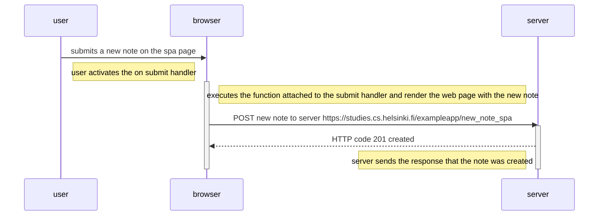

```mermaid

sequenceDiagram
    participant user
    participant browser
    participant server

    user->>browser: submits a new note on the spa page
    Note left of browser: user activates the on submit handler
    activate browser
    Note right of browser: executes the function attached to the submit handler and render the web page with the new note
    browser->>server: POST new note to server https://studies.cs.helsinki.fi/exampleapp/new_note_spa
    activate server
    server-->>browser: HTTP code 201 created
    Note left of server: server sends the response that the note was created
    deactivate server
    deactivate browser
```
